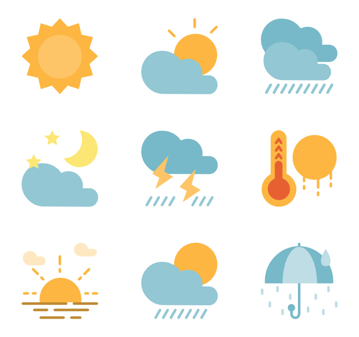

# weather-API
weather API

Get current weather of your city by tybe /city/?name = {your search city} when you logged in home page

**Requirements**
- python 3.5 or newer
- flask and requests lip.
- web browser

**Highlights**
- Use [OpenWeatherMap] API

use this link to open the app http://127.0.0.1:5000/city/?name= locally and enter your city
